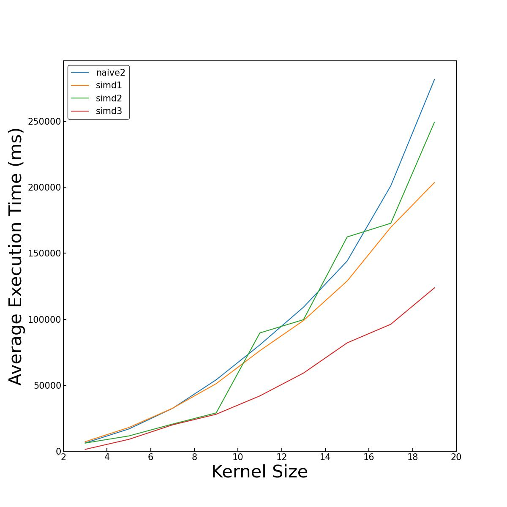

# SIMD Playground

Rust implementation of basic parallel convolution filters with Arm intrinsic.  
This implementation follows [this slideshare(Japanese)](https://www.slideshare.net/fixstars/arm-cpusimd/fixstars/arm-cpusimd), introducing in C++ originally.  
Original implementation only supports 3x3 kernel, but this also work with 5x5, 7x7.

You can see the benchmark result for different implementations with:
```bash
$ rustup install nightly-2022-03-01
$ cargo +nightly-2022-03-01 bench --bench main # You need nightly to benchmarking with "test" crate
```
**Note**: `rustc` has bug that originates in [#90621](https://github.com/rust-lang/rust/pull/90621#)(merged in 2022/3/15), then this implementation uses nightly-2022-03-01.

## Limitation
`ConvProcessor<K>::simd3` has bug and it does not work well for K >= 9 (K is kernel size) now.

## Benchmark
Results for different implementations.
Executed on:
```
OS:
- macOS Big Sur 11.6
Machine:
- Macbook Pro Apple M1 (16GB)
```
As mentioned above, `simd3` on K >= 9 does not process correctly (i.e. this bench was run with assertion disabled).
Thus, please take it as just a reference.  

